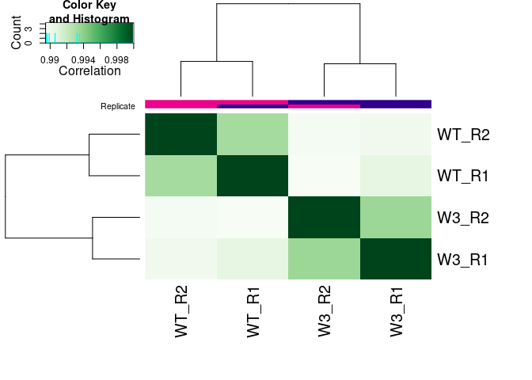
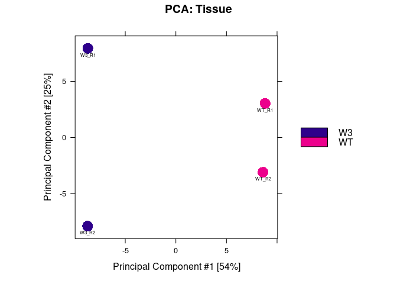
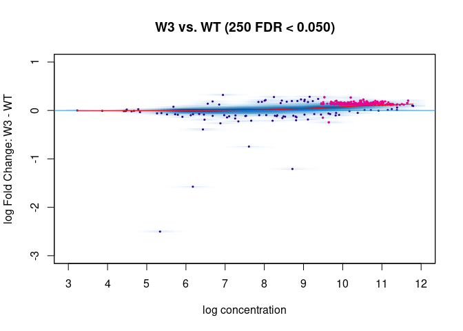
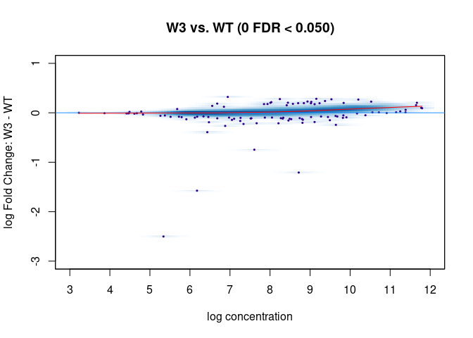

DiffBind_analysis
================
Guandong Shang
2022-05-29

由于在服务器的R版本升级到R 4.2之后，整个DiffBind的流程相比于之前R
3.6时代有了些许变化。所以这里我重新再写一份基于DiffBind的ChIP-seq差异分析。

具体的DiffBind文档参见[DiffBind官方文档](https://bioconductor.org/packages/release/bioc/vignettes/DiffBind/inst/doc/DiffBind.pdf)

# 准备工作

如果想要使用DiffBind的话，你需要准备好bam文件和peak文件。bam文件由比对产生，peak文件由MACS2等一系列callPeak软件产生。这里我使用的是常规的bowtie2比对，然后产生的bam文件用MACS2去callPeak这套流程。

我们首先来看下我们的rawdata文件里面的组成

``` bash
# tree是bash命令
# 只是我用来展示而已，并不能在R里面跑
tree rawdata
## rawdata
## ├── bam
## │   ├── input_W3_3_D1.rm_organelle.bam -> /data2/lxl_data/project/2020/04/Chip/1800_3_backup_Chip_H3K27me3_R6_W3_3_rep1/result/03_filter_alignment/input_W3_3_D1.rm_organelle.bam
## │   ├── input_W3_3_D2.rm_organelle.bam -> /data2/lxl_data/project/2020/04/Chip/1800_3_backup_Chip_H3K27me3_R6_W3_3_rep1/result/03_filter_alignment/input_W3_3_D2.rm_organelle.bam
## │   ├── input_WT_4_D1.rm_organelle.bam -> /data2/lxl_data/project/2020/04/Chip/1800_3_backup_Chip_H3K27me3_R6_W3_3_rep1/result/03_filter_alignment/input_WT_4_D1.rm_organelle.bam
## │   ├── input_WT_4_D2.rm_organelle.bam -> /data2/lxl_data/project/2020/04/Chip/1800_3_backup_Chip_H3K27me3_R6_W3_3_rep1/result/03_filter_alignment/input_WT_4_D2.rm_organelle.bam
## │   ├── W3_3_D1.rm_organelle.bam -> /data2/lxl_data/project/2020/04/Chip/1800_3_backup_Chip_H3K27me3_R6_W3_3_rep1/result/03_filter_alignment/W3_3_D1.rm_organelle.bam
## │   ├── W3_3_D2.rm_organelle.bam -> /data2/lxl_data/project/2020/04/Chip/1800_3_backup_Chip_H3K27me3_R6_W3_3_rep1/result/03_filter_alignment/W3_3_D2.rm_organelle.bam
## │   ├── WT_4_D1.rm_organelle.bam -> /data2/lxl_data/project/2020/04/Chip/1800_3_backup_Chip_H3K27me3_R6_W3_3_rep1/result/03_filter_alignment/WT_4_D1.rm_organelle.bam
## │   └── WT_4_D2.rm_organelle.bam -> /data2/lxl_data/project/2020/04/Chip/1800_3_backup_Chip_H3K27me3_R6_W3_3_rep1/result/03_filter_alignment/WT_4_D2.rm_organelle.bam
## └── peak
##     ├── W3_3_D1_peaks.broadPeak -> /data2/lxl_data/project/2020/04/Chip/1800_3_backup_Chip_H3K27me3_R6_W3_3_rep1/result/04_callpeak/div_peak/W3_3_D1_peaks.broadPeak
##     ├── W3_3_D2_peaks.broadPeak -> /data2/lxl_data/project/2020/04/Chip/1800_3_backup_Chip_H3K27me3_R6_W3_3_rep1/result/04_callpeak/div_peak/W3_3_D2_peaks.broadPeak
##     ├── WT_4_D1_peaks.broadPeak -> /data2/lxl_data/project/2020/04/Chip/1800_3_backup_Chip_H3K27me3_R6_W3_3_rep1/result/04_callpeak/div_peak/WT_4_D1_peaks.broadPeak
##     └── WT_4_D2_peaks.broadPeak -> /data2/lxl_data/project/2020/04/Chip/1800_3_backup_Chip_H3K27me3_R6_W3_3_rep1/result/04_callpeak/div_peak/WT_4_D2_peaks.broadPeak
## 
## 2 directories, 12 files
```

可以看到你需要准备好input和IP的bam、bam.bai以及对应的由bam所产生的peak文件。这里由于是H3K27me3的数据，所以产生的是broadPeak文件。

在将得到的bam和peak文件软链接到`rawdata`文件夹之后，我们就需要做一个表格来告诉DiffBind你的样本是什么，你的样本对应的处理是什么，你的样本对应的路径在哪里等等。

``` r
bam_files <- list.files("rawdata/bam", pattern = "bam$", 
                        full.names = TRUE)

bam_files
## [1] "rawdata/bam/input_W3_3_D1.rm_organelle.bam"
## [2] "rawdata/bam/input_W3_3_D2.rm_organelle.bam"
## [3] "rawdata/bam/input_WT_4_D1.rm_organelle.bam"
## [4] "rawdata/bam/input_WT_4_D2.rm_organelle.bam"
## [5] "rawdata/bam/W3_3_D1.rm_organelle.bam"      
## [6] "rawdata/bam/W3_3_D2.rm_organelle.bam"      
## [7] "rawdata/bam/WT_4_D1.rm_organelle.bam"      
## [8] "rawdata/bam/WT_4_D2.rm_organelle.bam"

peak_files <- list.files("rawdata/peak", 
                         full.names = TRUE)

peak_files
## [1] "rawdata/peak/W3_3_D1_peaks.broadPeak"
## [2] "rawdata/peak/W3_3_D2_peaks.broadPeak"
## [3] "rawdata/peak/WT_4_D1_peaks.broadPeak"
## [4] "rawdata/peak/WT_4_D2_peaks.broadPeak"
```

``` r
# 具体需要的列参见DiffBind的手册
# 这里只列出了需要完成一个简单的两样本比较最少需要的列
sample_info <- data.frame(
  SampleID = paste(rep(c("W3", "WT"), each = 2),
                    c("R1", "R2"),
                    sep = "_"),
  
  Tissue = rep(c("W3", "WT"), each = 2),
  
  Replicate = 1:2,
  
  bamReads = bam_files[5:8],
  
  ControlID = paste(rep(c("W3_input", "WT_input"), each = 2),
                    c("R1", "R2"),
                    sep = "_"),
  
  bamControl = bam_files[1:4],
  
  Peaks = peak_files,
  
  # 尽管我们这里是broadPeak
  # 但是由于broaPeak和narrowPeak的格式类似
  # 所以这里可以用narrowPeak
  PeakCaller = "narrow"
  
)

# 在做完之后要核对一下是否正确
sample_info
##   SampleID Tissue Replicate                             bamReads   ControlID
## 1    W3_R1     W3         1 rawdata/bam/W3_3_D1.rm_organelle.bam W3_input_R1
## 2    W3_R2     W3         2 rawdata/bam/W3_3_D2.rm_organelle.bam W3_input_R2
## 3    WT_R1     WT         1 rawdata/bam/WT_4_D1.rm_organelle.bam WT_input_R1
## 4    WT_R2     WT         2 rawdata/bam/WT_4_D2.rm_organelle.bam WT_input_R2
##                                   bamControl
## 1 rawdata/bam/input_W3_3_D1.rm_organelle.bam
## 2 rawdata/bam/input_W3_3_D2.rm_organelle.bam
## 3 rawdata/bam/input_WT_4_D1.rm_organelle.bam
## 4 rawdata/bam/input_WT_4_D2.rm_organelle.bam
##                                  Peaks PeakCaller
## 1 rawdata/peak/W3_3_D1_peaks.broadPeak     narrow
## 2 rawdata/peak/W3_3_D2_peaks.broadPeak     narrow
## 3 rawdata/peak/WT_4_D1_peaks.broadPeak     narrow
## 4 rawdata/peak/WT_4_D2_peaks.broadPeak     narrow
```

# DiffBind数据导入

``` r
library(DiffBind)

library(BiocParallel)
```

第一步是根据你整理的sample表来导入bam文件和peak文件

``` r
dba_H3K27me3 <- dba(minOverlap = 2, sampleSheet = sample_info)
## W3_R1 W3    1 narrow
## W3_R2 W3    2 narrow
## WT_R1 WT    1 narrow
## WT_R2 WT    2 narrow

# 通过对象展现的数据
# 我们可以有个大致了解你每个样本的peak数目是多少
# 可以看到，在合并了全部的peak之后，得到了9060个peak
# 然后由于我们的minOverlap设置为2，所以最终得到了8507个peak在至少两个样本都是出现的
dba_H3K27me3
## 4 Samples, 8507 sites in matrix (9060 total):
##      ID Tissue Replicate Intervals
## 1 W3_R1     W3         1      8601
## 2 W3_R2     W3         2      9073
## 3 WT_R1     WT         1      8651
## 4 WT_R2     WT         2      8690
```

需要注意的是之前我一直以为这里的`minOverlap=2`是指peak要在你同一处理中两个重复中都有才会将其考虑在内。但实际上，`minOverlap=2`只是单纯得到哪些在任意两个样本中都有的peak。对于我们这个4个broadPeak的样本而言，你可以选择`minOverlap`为1,2,3,4。

``` r
# 分别代表了至少在1,2,3,4个样本中都有的peak数目
# 8507就是我们最终的数目
dba.overlap(dba_H3K27me3, mode = DBA_OLAP_RATE)
## [1] 9060 8507 8139 7748
```

如果你想要得到在A中至少两个重复有，或者B中至少两个重复有的peak，参考[DiffBind
minOverlap parameter](https://support.bioconductor.org/p/125808/)。

# 生成Graylist

在我们R
3.6的时代，DiffBind的默认操作是IP的count减去对应的input的count。但大家认为这样可能并不是非常地准确，所以在R
4.2这个版本的DiffBind在做差异分析时候使用的count是IP自身的peakCount，而不是IP减去input的count。
对应的，作者使用了`greylist`这个方法来充分使用input的信息。具体的`greylist`信息参见DiffBin的文档和[Generating
Grey Lists from Input
Libraries](https://bioconductor.org/packages/release/bioc/vignettes/GreyListChIP/inst/doc/GreyList-demo.pdf)

在做dba.blacklist之前，我们需要得到你物种的seqinfo。如果你之前物种已经做过了Txdb，且做Txdb的时候将染色体长度放进去了。后面直接`greylist=seqinfo(Txdb)`就可以了。如果没有的话，就需要再重新做一次

``` r
# fa.fai是靠samtools faidx做出来的
# 这里的基因组就是你比对的基因组
chromInfo <- read.table("/data2/lxl_data/reference/genome/1800/1800_fa_nin_nsq_nhr/1800.fa.fai")

head(chromInfo)
##        V1       V2       V3       V4       V5
## 1 contig1 21696914        9 21696914 21696915
## 2 contig2 19298535 21696933 19298535 19298536
## 3 contig3 18248988 40995478 18248988 18248989
## 4 contig4 15269058 59244476 15269058 15269059
## 5 contig5 15222542 74513544 15222542 15222543
## 6 contig6 14413918 89736096 14413918 14413919

seqinfo_obj <- Seqinfo(seqnames = chromInfo$V1,
                       seqlengths = chromInfo$V2)
seqinfo_obj
## Seqinfo object with 324 sequences from an unspecified genome:
##   seqnames  seqlengths isCircular genome
##   contig1     21696914       <NA>   <NA>
##   contig2     19298535       <NA>   <NA>
##   contig3     18248988       <NA>   <NA>
##   contig4     15269058       <NA>   <NA>
##   contig5     15222542       <NA>   <NA>
##   ...              ...        ...    ...
##   contig320       2727       <NA>   <NA>
##   contig321       2620       <NA>   <NA>
##   contig322       2532       <NA>   <NA>
##   contig323       2506       <NA>   <NA>
##   contig324       2221       <NA>   <NA>
```

``` r
# 由于非模式物种没有blacklist
# 所以只跑一个greylist
dba_H3K27me3 <- dba.blacklist(dba_H3K27me3,
                              blacklist = FALSE,
                              greylist = seqinfo_obj)
## Counting control reads for greylist...
## Building greylist: rawdata/bam/input_W3_3_D1.rm_organelle.bam
## coverage: 23552 bp (0.01%)
## Building greylist: rawdata/bam/input_W3_3_D2.rm_organelle.bam
## coverage: 4096 bp (0.00%)
## Building greylist: rawdata/bam/input_WT_4_D1.rm_organelle.bam
## coverage: 21504 bp (0.01%)
## Building greylist: rawdata/bam/input_WT_4_D2.rm_organelle.bam
## coverage: 28160 bp (0.01%)
## W3_input_R1: 4 ranges, 23552 bases
## W3_input_R2: 3 ranges, 4096 bases
## WT_input_R1: 3 ranges, 21504 bases
## WT_input_R2: 5 ranges, 28160 bases
## Master greylist: 7 ranges, 31232 bases
## Removed: 8 of 35015 intervals.
## Removed: 2 merged (of 9060) and 2 (of 8507) consensus.

# 可以看到从原来的8507变成了8505，去掉了两个区域
dba_H3K27me3
## 4 Samples, 8505 sites in matrix (9058 total):
##      ID Tissue Replicate Intervals
## 1 W3_R1     W3         1      8599
## 2 W3_R2     W3         2      9071
## 3 WT_R1     WT         1      8649
## 4 WT_R2     WT         2      8688
```

# 数count

这一步是根据你的bam文件和合并得到的peak
location去数每个peak里面的count。

需要注意的是在我们之前的DiffBind版本中，默认地是不summit
peak的。而在这个版本的DiffBind中，默认地是设置`summit=200`，即首先将前面得到的peak合集根据你的summit位点左右扩增200bp，最终所有的peak就都会是400bp了。
对于像H3K27me3这种比较宽的peak，长度太长的话，两相比较，统计会不显著。而如果我们根据peak
summit，recenter peak之后，就可以提高我们发现显著差异peak的能力了。

> 这个参数大家根据自己的需要来确定是否是FALSE。像我ATAC-seq一般会调整成summit=FALSE，而H3K27me3则不调整。TF
> ChIP-seq也可以尝试summit=FALSE。

``` r
dba_H3K27me3 <- dba.count(dba_H3K27me3)
## Computing summits...
## Re-centering peaks...

# 在count完了之后还会报告FRiP
# 则你peak里面的count数目占对应bam的count数目
dba_H3K27me3
## 4 Samples, 8505 sites in matrix:
##      ID Tissue Replicate    Reads FRiP
## 1 W3_R1     W3         1 15964923 0.26
## 2 W3_R2     W3         2 14713680 0.25
## 3 WT_R1     WT         1 14382106 0.23
## 4 WT_R2     WT         2 12805359 0.24
```

``` r
# 这时候可以画一个相关性图
dba.plotHeatmap(dba_H3K27me3)
```

<!-- -->

``` r
# 或者PCA图
dba.plotPCA(dba_H3K27me3,
            label=DBA_ID,
            labelSize = 0.5)
```

<!-- -->

# Normalizing the data

这一步是对你的peak
count矩阵做矫正，类似于我们RNA-seq分析的时候DESeq2的那种矫正。
但是DiffBind这里默认的矫正并不是DESeq2，具体的细节大家可以自己去看文档。

``` r
dba_H3K27me3 <- dba.normalize(dba_H3K27me3)
```

# Establishing a model design and contrast

这一步是定义好你要谁和谁进行比较

``` r
# 这里contrast用法跟DESeq2是一样的
dba_H3K27me3 <- dba.contrast(dba_H3K27me3,
                             contrast = c("Tissue", "W3", "WT"))
## Computing results names...

dba_H3K27me3
## 4 Samples, 8505 sites in matrix:
##      ID Tissue Replicate    Reads FRiP
## 1 W3_R1     W3         1 15964923 0.26
## 2 W3_R2     W3         2 14713680 0.25
## 3 WT_R1     WT         1 14382106 0.23
## 4 WT_R2     WT         2 12805359 0.24
## 
## Design: [~Tissue] | 1 Contrast:
##   Factor Group Samples Group2 Samples2
## 1 Tissue    W3       2     WT        2
```

# Performing the differential analysis

这一步就是做差异分析了，默认是调用DESeq2

``` r
# 我们前面算过greylist了
# 这里就不用算了
dba_H3K27me3 <- dba.analyze(dba_H3K27me3,
                            bBlacklist = FALSE,
                            bGreylist = FALSE)
## Analyzing...
## gene-wise dispersion estimates
## mean-dispersion relationship
## final dispersion estimates
```

``` r
# 可以画一个MAplot
# 你可以调整fold的数值
# 默认是0

# 但需要注意的是，R 4.2版本的DIffBind dba.plotMA跟我们之前的3.6版本对应的dba.plotMA在对Fold的设定上有着完全不同的结果
# 根据manual来看，一旦你设定了Fold的数值，那么对应的p-value和FDR就会重新计算
# 这相当于DESeq2 results函数里面去设定Fold
# 结果会比较严格

# 所以对于这个版本的DiffBind而言，建议plotMA只是作为一个参考
# 如果想要画图的话，可以考虑自己用ggplot2画火山图
dba.plotMA(dba_H3K27me3)
## Warning in KernSmooth::bkde2D(x, bandwidth = bandwidth, gridsize = nbin, :
## Binning grid too coarse for current (small) bandwidth: consider increasing
## 'gridsize'
```

<!-- -->

``` r
dba.plotMA(dba_H3K27me3, fold = 1)
## Warning in KernSmooth::bkde2D(x, bandwidth = bandwidth, gridsize = nbin, :
## Binning grid too coarse for current (small) bandwidth: consider increasing
## 'gridsize'
```

<!-- -->

# Retrieving the differentially bound sites

``` r
# th=1可以输出所有的结果
result_diff <- dba.report(dba_H3K27me3,
                          th = 1)

# 输出的对象是GRange类型的
# 是按照FDR的顺序进行排序的
# 这里的Conc_XX是log2(norm Reads)之后的值
# 如果你想要输出的格式是按照location排的，可以sort(result_diff)
result_diff
## GRanges object with 8505 ranges and 6 metadata columns:
##        seqnames            ranges strand |      Conc   Conc_W3   Conc_WT
##           <Rle>         <IRanges>  <Rle> | <numeric> <numeric> <numeric>
##   7429  contig7 11889839-11890239      * |  10.20462  10.38417   9.99951
##    796 contig10       26447-26847      * |   9.53317   9.74577   9.28373
##   4137 contig24   1511038-1511438      * |  11.66786  11.78945  11.53507
##   7172  contig7   6506656-6507056      * |  10.52570  10.67418  10.36016
##   2797 contig15   3825166-3825566      * |   9.64437   9.43021   9.83080
##    ...      ...               ...    ... .       ...       ...       ...
##   4892  contig3   8400675-8401075      * |   6.73435   6.73429   6.73441
##   4121 contig24   1308980-1309380      * |   6.49500   6.49486   6.49514
##   1603 contig11   5852974-5853374      * |   8.28158   8.28100   8.28217
##   4347 contig27     543737-544137      * |   6.72261   6.72366   6.72156
##   1662 contig11   7282924-7283324      * |   6.23686   6.23761   6.23611
##                Fold     p-value         FDR
##           <numeric>   <numeric>   <numeric>
##   7429     0.267612 8.61078e-08 0.000150258
##    796     0.272922 5.73465e-07 0.000351636
##   4137     0.202208 6.04531e-07 0.000351636
##   7172     0.225731 1.22712e-06 0.000535329
##   2797    -0.244096 2.61902e-06 0.000914039
##    ...          ...         ...         ...
##   4892  2.11844e-05    0.999482           1
##   4121  2.02239e-05    0.999485           1
##   1603  2.69890e-05    0.999504           1
##   4347 -1.54284e-05    0.999631           1
##   1662  7.31528e-06    0.999803           1
##   -------
##   seqinfo: 42 sequences from an unspecified genome; no seqlengths
```

# 提取结果

我们首先重命名GRanges中每个peak的名字，这会方便我们同时在IGV中对照着看结果。
然后我们再加一列peak的id，这会方便我们的以后的操作。

``` r
names(result_diff) <- paste0("H3K27me3_", names(result_diff))
result_diff$feature_id <- names(result_diff)

result_diff
## GRanges object with 8505 ranges and 7 metadata columns:
##                 seqnames            ranges strand |      Conc   Conc_W3
##                    <Rle>         <IRanges>  <Rle> | <numeric> <numeric>
##   H3K27me3_7429  contig7 11889839-11890239      * |  10.20462  10.38417
##    H3K27me3_796 contig10       26447-26847      * |   9.53317   9.74577
##   H3K27me3_4137 contig24   1511038-1511438      * |  11.66786  11.78945
##   H3K27me3_7172  contig7   6506656-6507056      * |  10.52570  10.67418
##   H3K27me3_2797 contig15   3825166-3825566      * |   9.64437   9.43021
##             ...      ...               ...    ... .       ...       ...
##   H3K27me3_4892  contig3   8400675-8401075      * |   6.73435   6.73429
##   H3K27me3_4121 contig24   1308980-1309380      * |   6.49500   6.49486
##   H3K27me3_1603 contig11   5852974-5853374      * |   8.28158   8.28100
##   H3K27me3_4347 contig27     543737-544137      * |   6.72261   6.72366
##   H3K27me3_1662 contig11   7282924-7283324      * |   6.23686   6.23761
##                   Conc_WT         Fold     p-value         FDR    feature_id
##                 <numeric>    <numeric>   <numeric>   <numeric>   <character>
##   H3K27me3_7429   9.99951     0.267612 8.61078e-08 0.000150258 H3K27me3_7429
##    H3K27me3_796   9.28373     0.272922 5.73465e-07 0.000351636  H3K27me3_796
##   H3K27me3_4137  11.53507     0.202208 6.04531e-07 0.000351636 H3K27me3_4137
##   H3K27me3_7172  10.36016     0.225731 1.22712e-06 0.000535329 H3K27me3_7172
##   H3K27me3_2797   9.83080    -0.244096 2.61902e-06 0.000914039 H3K27me3_2797
##             ...       ...          ...         ...         ...           ...
##   H3K27me3_4892   6.73441  2.11844e-05    0.999482           1 H3K27me3_4892
##   H3K27me3_4121   6.49514  2.02239e-05    0.999485           1 H3K27me3_4121
##   H3K27me3_1603   8.28217  2.69890e-05    0.999504           1 H3K27me3_1603
##   H3K27me3_4347   6.72156 -1.54284e-05    0.999631           1 H3K27me3_4347
##   H3K27me3_1662   6.23611  7.31528e-06    0.999803           1 H3K27me3_1662
##   -------
##   seqinfo: 42 sequences from an unspecified genome; no seqlengths
```

然后我们可以输出这个GRanges格式成bed文件，方便我们导入到IGV里面查看

``` r
# 加一个sort可以让输出bed结果看起来整齐
rtracklayer::export.bed(sort(result_diff),
                        con = "result/H3K27me3_diff.merge.bed")
```

``` bash
# 调用bash中的head命令看下我们输出的bed文件
head result/H3K27me3_diff.merge.bed
## contig1  86731   87132   H3K27me3_1  0   .
## contig1  99765   100166  H3K27me3_2  0   .
## contig1  101935  102336  H3K27me3_3  0   .
## contig1  106616  107017  H3K27me3_4  0   .
## contig1  210805  211206  H3K27me3_5  0   .
## contig1  348562  348963  H3K27me3_6  0   .
## contig1  484270  484671  H3K27me3_7  0   .
## contig1  566886  567287  H3K27me3_8  0   .
## contig1  985447  985848  H3K27me3_9  0   .
## contig1  1169520 1169921 H3K27me3_10 0   .
```

然后对于差异分析的结果，我们可以转换成tibble或者df格式，然后输出成csv

``` r
readr::write_csv(as.data.frame(result_diff),
                 file = "result/H3K27me3_diff.csv")
```

因为后续我们还需要对peak进行注释，所以我们也需要保存所产生的GRanges对象

``` r
save(result_diff, file = "result/H3K27me3_diff_Gr.rda")
```

有些人可能还需要用对应样本的数值来画热图，所以我们这里也可以提取出每个peak在每个样本中矫正后的数值

``` r
normCount_mt <- mcols(dba.peakset(dba_H3K27me3, bRetrieve = TRUE))

head(normCount_mt)
## DataFrame with 6 rows and 4 columns
##       W3_R1     W3_R2     WT_R1     WT_R2
##   <numeric> <numeric> <numeric> <numeric>
## 1   699.543   653.829   681.979   691.391
## 2   118.705   134.699   119.698   138.956
## 3   310.807   368.701   283.655   334.398
## 4   236.504   226.136   244.426   213.518
## 5   335.273   305.776   313.831   327.620
## 6   159.481   158.295   123.722   150.253

# 我们可以给其加行名
rownames(normCount_mt) <- paste0("H3K27me3_", rownames(normCount_mt))

normCount_mt <- as.matrix(normCount_mt)
save(normCount_mt, file = "result/normCount_mt.rda")
```

前面提到了`result_diff`里面的`Conc_XX`是log2(normReads)之后的结果，我们可以来检查下

``` r
result_diff["H3K27me3_3011"]
## GRanges object with 1 range and 7 metadata columns:
##                 seqnames          ranges strand |      Conc   Conc_W3   Conc_WT
##                    <Rle>       <IRanges>  <Rle> | <numeric> <numeric> <numeric>
##   H3K27me3_3011 contig17 5373691-5374091      * |   5.33885   3.36118   6.14298
##                      Fold     p-value       FDR    feature_id
##                 <numeric>   <numeric> <numeric>   <character>
##   H3K27me3_3011  -2.50139 7.27023e-10         1 H3K27me3_3011
##   -------
##   seqinfo: 42 sequences from an unspecified genome; no seqlengths

# 几乎是一模一样的
mean(log2(normCount_mt["H3K27me3_3011", c(1:2)]))
## [1] 3.320363
mean(log2(normCount_mt["H3K27me3_3011", c(3:4)]))
## [1] 6.142537
```

# 一些乱七八糟的

对于DEX诱导的GR TF
ChIP-seq。我发现由于GR渗漏的原因，可能会漏掉一些位点。对于这种情况，如果这个位点对你很重要，可以考虑用`csaw`包去做差异peak分析。

``` r
sessionInfo()
## R version 4.2.0 (2022-04-22)
## Platform: x86_64-pc-linux-gnu (64-bit)
## Running under: CentOS Stream 8
## 
## Matrix products: default
## BLAS:   /opt/sysoft/R-4.2.0/lib64/R/lib/libRblas.so
## LAPACK: /opt/sysoft/R-4.2.0/lib64/R/lib/libRlapack.so
## 
## locale:
##  [1] LC_CTYPE=en_US.UTF-8       LC_NUMERIC=C              
##  [3] LC_TIME=en_US.UTF-8        LC_COLLATE=en_US.UTF-8    
##  [5] LC_MONETARY=en_US.UTF-8    LC_MESSAGES=en_US.UTF-8   
##  [7] LC_PAPER=en_US.UTF-8       LC_NAME=C                 
##  [9] LC_ADDRESS=C               LC_TELEPHONE=C            
## [11] LC_MEASUREMENT=en_US.UTF-8 LC_IDENTIFICATION=C       
## 
## attached base packages:
## [1] stats4    stats     graphics  grDevices utils     datasets  methods  
## [8] base     
## 
## other attached packages:
##  [1] BiocParallel_1.30.2         DiffBind_3.6.1             
##  [3] SummarizedExperiment_1.26.1 Biobase_2.56.0             
##  [5] MatrixGenerics_1.8.0        matrixStats_0.62.0         
##  [7] GenomicRanges_1.48.0        GenomeInfoDb_1.32.2        
##  [9] IRanges_2.30.0              S4Vectors_0.34.0           
## [11] BiocGenerics_0.42.0        
## 
## loaded via a namespace (and not attached):
##   [1] amap_0.8-18              colorspace_2.0-3         rjson_0.2.21            
##   [4] hwriter_1.3.2.1          ellipsis_0.3.2           XVector_0.36.0          
##   [7] rstudioapi_0.13          ggrepel_0.9.1            bit64_4.0.5             
##  [10] AnnotationDbi_1.58.0     fansi_1.0.3              mvtnorm_1.1-3           
##  [13] apeglm_1.18.0            splines_4.2.0            cachem_1.0.6            
##  [16] geneplotter_1.74.0       knitr_1.39               Rsamtools_2.12.0        
##  [19] annotate_1.74.0          ashr_2.2-54              png_0.1-7               
##  [22] GreyListChIP_1.28.1      readr_2.1.2              compiler_4.2.0          
##  [25] httr_1.4.3               assertthat_0.2.1         Matrix_1.4-1            
##  [28] fastmap_1.1.0            limma_3.52.1             cli_3.3.0               
##  [31] htmltools_0.5.2          tools_4.2.0              coda_0.19-4             
##  [34] gtable_0.3.0             glue_1.6.2               GenomeInfoDbData_1.2.8  
##  [37] systemPipeR_2.2.2        dplyr_1.0.9              ShortRead_1.54.0        
##  [40] Rcpp_1.0.8.3             bbmle_1.0.25             vctrs_0.4.1             
##  [43] Biostrings_2.64.0        rtracklayer_1.56.0       xfun_0.31               
##  [46] stringr_1.4.0            lifecycle_1.0.1          irlba_2.3.5             
##  [49] restfulr_0.0.13          gtools_3.9.2.1           XML_3.99-0.9            
##  [52] zlibbioc_1.42.0          MASS_7.3-56              scales_1.2.0            
##  [55] vroom_1.5.7              BSgenome_1.64.0          hms_1.1.1               
##  [58] parallel_4.2.0           RColorBrewer_1.1-3       yaml_2.3.5              
##  [61] memoise_2.0.1            ggplot2_3.3.6            emdbook_1.3.12          
##  [64] bdsmatrix_1.3-4          latticeExtra_0.6-29      stringi_1.7.6           
##  [67] RSQLite_2.2.14           SQUAREM_2021.1           highr_0.9               
##  [70] genefilter_1.78.0        BiocIO_1.6.0             caTools_1.18.2          
##  [73] truncnorm_1.0-8          rlang_1.0.2              pkgconfig_2.0.3         
##  [76] bitops_1.0-7             evaluate_0.15            lattice_0.20-45         
##  [79] invgamma_1.1             purrr_0.3.4              GenomicAlignments_1.32.0
##  [82] htmlwidgets_1.5.4        bit_4.0.4                tidyselect_1.1.2        
##  [85] plyr_1.8.7               magrittr_2.0.3           DESeq2_1.36.0           
##  [88] R6_2.5.1                 gplots_3.1.3             generics_0.1.2          
##  [91] DelayedArray_0.22.0      DBI_1.1.2                pillar_1.7.0            
##  [94] survival_3.3-1           KEGGREST_1.36.0          RCurl_1.98-1.6          
##  [97] mixsqp_0.3-43            tibble_3.1.7             crayon_1.5.1            
## [100] KernSmooth_2.23-20       utf8_1.2.2               tzdb_0.3.0              
## [103] rmarkdown_2.14           jpeg_0.1-9               locfit_1.5-9.5          
## [106] grid_4.2.0               blob_1.2.3               digest_0.6.29           
## [109] xtable_1.8-4             numDeriv_2016.8-1.1      munsell_0.5.0
```
