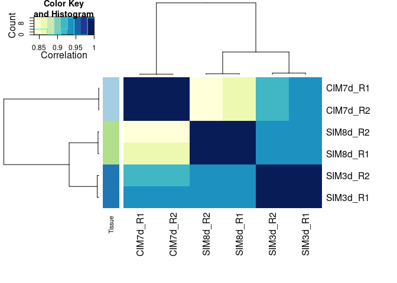
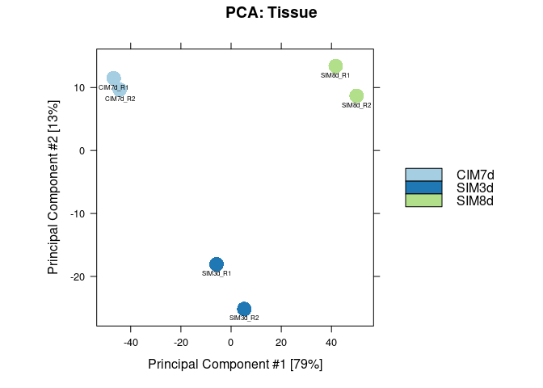

DiffBind_analysis_Advanced
================
Guandong Shang
2022-05-29

这一个文档主要是介绍下在你有多个类型的ChIP-seq下，如何基于DiffBind批量化的去做差异分析。基本的分析参见之前的那个文档。

这里用的是一套三个时间点的H3K27ac的组蛋白数据

``` bash
tree rawdata
## rawdata
## ├── bam
## │   ├── H3K27ac_C71.rm_organelle.bam -> /home/sgd/project/202005/WLY_Total_Fig_202005/histone_analysis/rawdata/H3K27ac/bam/H3K27ac_C71.rm_organelle.bam
## │   ├── H3K27ac_C71.rm_organelle.bam.bai -> /home/sgd/project/202005/WLY_Total_Fig_202005/histone_analysis/rawdata/H3K27ac/bam/H3K27ac_C71.rm_organelle.bam.bai
## │   ├── H3K27ac_C72.rm_organelle.bam -> /home/sgd/project/202005/WLY_Total_Fig_202005/histone_analysis/rawdata/H3K27ac/bam/H3K27ac_C72.rm_organelle.bam
## │   ├── H3K27ac_C72.rm_organelle.bam.bai -> /home/sgd/project/202005/WLY_Total_Fig_202005/histone_analysis/rawdata/H3K27ac/bam/H3K27ac_C72.rm_organelle.bam.bai
## │   ├── H3K27ac_S31.rm_organelle.bam -> /home/sgd/project/202005/WLY_Total_Fig_202005/histone_analysis/rawdata/H3K27ac/bam/H3K27ac_S31.rm_organelle.bam
## │   ├── H3K27ac_S31.rm_organelle.bam.bai -> /home/sgd/project/202005/WLY_Total_Fig_202005/histone_analysis/rawdata/H3K27ac/bam/H3K27ac_S31.rm_organelle.bam.bai
## │   ├── H3K27ac_S32.rm_organelle.bam -> /home/sgd/project/202005/WLY_Total_Fig_202005/histone_analysis/rawdata/H3K27ac/bam/H3K27ac_S32.rm_organelle.bam
## │   ├── H3K27ac_S32.rm_organelle.bam.bai -> /home/sgd/project/202005/WLY_Total_Fig_202005/histone_analysis/rawdata/H3K27ac/bam/H3K27ac_S32.rm_organelle.bam.bai
## │   ├── H3K27ac_S81.rm_organelle.bam -> /home/sgd/project/202005/WLY_Total_Fig_202005/histone_analysis/rawdata/H3K27ac/bam/H3K27ac_S81.rm_organelle.bam
## │   ├── H3K27ac_S81.rm_organelle.bam.bai -> /home/sgd/project/202005/WLY_Total_Fig_202005/histone_analysis/rawdata/H3K27ac/bam/H3K27ac_S81.rm_organelle.bam.bai
## │   ├── H3K27ac_S82.rm_organelle.bam -> /home/sgd/project/202005/WLY_Total_Fig_202005/histone_analysis/rawdata/H3K27ac/bam/H3K27ac_S82.rm_organelle.bam
## │   ├── H3K27ac_S82.rm_organelle.bam.bai -> /home/sgd/project/202005/WLY_Total_Fig_202005/histone_analysis/rawdata/H3K27ac/bam/H3K27ac_S82.rm_organelle.bam.bai
## │   ├── Input_C71.rm_organelle.bam -> /home/sgd/project/202005/WLY_Total_Fig_202005/histone_analysis/rawdata/H3K27ac/bam/Input_C71.rm_organelle.bam
## │   ├── Input_C71.rm_organelle.bam.bai -> /home/sgd/project/202005/WLY_Total_Fig_202005/histone_analysis/rawdata/H3K27ac/bam/Input_C71.rm_organelle.bam.bai
## │   ├── Input_C72.rm_organelle.bam -> /home/sgd/project/202005/WLY_Total_Fig_202005/histone_analysis/rawdata/H3K27ac/bam/Input_C72.rm_organelle.bam
## │   ├── Input_C72.rm_organelle.bam.bai -> /home/sgd/project/202005/WLY_Total_Fig_202005/histone_analysis/rawdata/H3K27ac/bam/Input_C72.rm_organelle.bam.bai
## │   ├── Input_S31.rm_organelle.bam -> /home/sgd/project/202005/WLY_Total_Fig_202005/histone_analysis/rawdata/H3K27ac/bam/Input_S31.rm_organelle.bam
## │   ├── Input_S31.rm_organelle.bam.bai -> /home/sgd/project/202005/WLY_Total_Fig_202005/histone_analysis/rawdata/H3K27ac/bam/Input_S31.rm_organelle.bam.bai
## │   ├── Input_S32.rm_organelle.bam -> /home/sgd/project/202005/WLY_Total_Fig_202005/histone_analysis/rawdata/H3K27ac/bam/Input_S32.rm_organelle.bam
## │   ├── Input_S32.rm_organelle.bam.bai -> /home/sgd/project/202005/WLY_Total_Fig_202005/histone_analysis/rawdata/H3K27ac/bam/Input_S32.rm_organelle.bam.bai
## │   ├── Input_S81.rm_organelle.bam -> /home/sgd/project/202005/WLY_Total_Fig_202005/histone_analysis/rawdata/H3K27ac/bam/Input_S81.rm_organelle.bam
## │   ├── Input_S81.rm_organelle.bam.bai -> /home/sgd/project/202005/WLY_Total_Fig_202005/histone_analysis/rawdata/H3K27ac/bam/Input_S81.rm_organelle.bam.bai
## │   ├── Input_S82.rm_organelle.bam -> /home/sgd/project/202005/WLY_Total_Fig_202005/histone_analysis/rawdata/H3K27ac/bam/Input_S82.rm_organelle.bam
## │   └── Input_S82.rm_organelle.bam.bai -> /home/sgd/project/202005/WLY_Total_Fig_202005/histone_analysis/rawdata/H3K27ac/bam/Input_S82.rm_organelle.bam.bai
## └── peak
##     ├── H3K27ac_C71_peaks.narrowPeak -> /home/sgd/project/202005/WLY_Total_Fig_202005/histone_analysis/rawdata/H3K27ac/peak/H3K27ac_C71_peaks.narrowPeak
##     ├── H3K27ac_C72_peaks.narrowPeak -> /home/sgd/project/202005/WLY_Total_Fig_202005/histone_analysis/rawdata/H3K27ac/peak/H3K27ac_C72_peaks.narrowPeak
##     ├── H3K27ac_S31_peaks.narrowPeak -> /home/sgd/project/202005/WLY_Total_Fig_202005/histone_analysis/rawdata/H3K27ac/peak/H3K27ac_S31_peaks.narrowPeak
##     ├── H3K27ac_S32_peaks.narrowPeak -> /home/sgd/project/202005/WLY_Total_Fig_202005/histone_analysis/rawdata/H3K27ac/peak/H3K27ac_S32_peaks.narrowPeak
##     ├── H3K27ac_S81_peaks.narrowPeak -> /home/sgd/project/202005/WLY_Total_Fig_202005/histone_analysis/rawdata/H3K27ac/peak/H3K27ac_S81_peaks.narrowPeak
##     └── H3K27ac_S82_peaks.narrowPeak -> /home/sgd/project/202005/WLY_Total_Fig_202005/histone_analysis/rawdata/H3K27ac/peak/H3K27ac_S82_peaks.narrowPeak
## 
## 2 directories, 30 files
```

# 前期准备

``` r
library(DiffBind)
## Loading required package: GenomicRanges
## Loading required package: stats4
## Loading required package: BiocGenerics
## 
## Attaching package: 'BiocGenerics'
## The following objects are masked from 'package:stats':
## 
##     IQR, mad, sd, var, xtabs
## The following objects are masked from 'package:base':
## 
##     anyDuplicated, append, as.data.frame, basename, cbind, colnames,
##     dirname, do.call, duplicated, eval, evalq, Filter, Find, get, grep,
##     grepl, intersect, is.unsorted, lapply, Map, mapply, match, mget,
##     order, paste, pmax, pmax.int, pmin, pmin.int, Position, rank,
##     rbind, Reduce, rownames, sapply, setdiff, sort, table, tapply,
##     union, unique, unsplit, which.max, which.min
## Loading required package: S4Vectors
## 
## Attaching package: 'S4Vectors'
## The following objects are masked from 'package:base':
## 
##     expand.grid, I, unname
## Loading required package: IRanges
## Loading required package: GenomeInfoDb
## Loading required package: SummarizedExperiment
## Loading required package: MatrixGenerics
## Loading required package: matrixStats
## 
## Attaching package: 'MatrixGenerics'
## The following objects are masked from 'package:matrixStats':
## 
##     colAlls, colAnyNAs, colAnys, colAvgsPerRowSet, colCollapse,
##     colCounts, colCummaxs, colCummins, colCumprods, colCumsums,
##     colDiffs, colIQRDiffs, colIQRs, colLogSumExps, colMadDiffs,
##     colMads, colMaxs, colMeans2, colMedians, colMins, colOrderStats,
##     colProds, colQuantiles, colRanges, colRanks, colSdDiffs, colSds,
##     colSums2, colTabulates, colVarDiffs, colVars, colWeightedMads,
##     colWeightedMeans, colWeightedMedians, colWeightedSds,
##     colWeightedVars, rowAlls, rowAnyNAs, rowAnys, rowAvgsPerColSet,
##     rowCollapse, rowCounts, rowCummaxs, rowCummins, rowCumprods,
##     rowCumsums, rowDiffs, rowIQRDiffs, rowIQRs, rowLogSumExps,
##     rowMadDiffs, rowMads, rowMaxs, rowMeans2, rowMedians, rowMins,
##     rowOrderStats, rowProds, rowQuantiles, rowRanges, rowRanks,
##     rowSdDiffs, rowSds, rowSums2, rowTabulates, rowVarDiffs, rowVars,
##     rowWeightedMads, rowWeightedMeans, rowWeightedMedians,
##     rowWeightedSds, rowWeightedVars
## Loading required package: Biobase
## Welcome to Bioconductor
## 
##     Vignettes contain introductory material; view with
##     'browseVignettes()'. To cite Bioconductor, see
##     'citation("Biobase")', and for packages 'citation("pkgname")'.
## 
## Attaching package: 'Biobase'
## The following object is masked from 'package:MatrixGenerics':
## 
##     rowMedians
## The following objects are masked from 'package:matrixStats':
## 
##     anyMissing, rowMedians
##  >>> DiffBind 3.6.1

library(BiocParallel)

library(magrittr)
## 
## Attaching package: 'magrittr'
## The following object is masked from 'package:GenomicRanges':
## 
##     subtract
```

``` r
bam_files <- list.files("rawdata/bam",pattern = "bam$", full.names = T)
peak_files <- list.files("rawdata/peak", full.names = T)

bam_files
##  [1] "rawdata/bam/H3K27ac_C71.rm_organelle.bam"
##  [2] "rawdata/bam/H3K27ac_C72.rm_organelle.bam"
##  [3] "rawdata/bam/H3K27ac_S31.rm_organelle.bam"
##  [4] "rawdata/bam/H3K27ac_S32.rm_organelle.bam"
##  [5] "rawdata/bam/H3K27ac_S81.rm_organelle.bam"
##  [6] "rawdata/bam/H3K27ac_S82.rm_organelle.bam"
##  [7] "rawdata/bam/Input_C71.rm_organelle.bam"  
##  [8] "rawdata/bam/Input_C72.rm_organelle.bam"  
##  [9] "rawdata/bam/Input_S31.rm_organelle.bam"  
## [10] "rawdata/bam/Input_S32.rm_organelle.bam"  
## [11] "rawdata/bam/Input_S81.rm_organelle.bam"  
## [12] "rawdata/bam/Input_S82.rm_organelle.bam"

peak_files
## [1] "rawdata/peak/H3K27ac_C71_peaks.narrowPeak"
## [2] "rawdata/peak/H3K27ac_C72_peaks.narrowPeak"
## [3] "rawdata/peak/H3K27ac_S31_peaks.narrowPeak"
## [4] "rawdata/peak/H3K27ac_S32_peaks.narrowPeak"
## [5] "rawdata/peak/H3K27ac_S81_peaks.narrowPeak"
## [6] "rawdata/peak/H3K27ac_S82_peaks.narrowPeak"
```

``` r
tissue <- rep(c("CIM7d", "SIM3d", "SIM8d"), each = 2)

sample_info <- data.frame(
  SampleID = paste(tissue, c("R1", "R2"), sep = "_") ,
  
  Tissue = tissue,
  
  Replicate = 1:2,
  
  bamReads = bam_files[1:6], 
  
  ControlID = paste(tissue, "control", c("R1", "R2"), sep = "_"), 
  
  bamControl = bam_files[7:12], 
  
  Peaks = peak_files, 
  
  PeakCaller = "narrow"
  
  
) 

sample_info
##   SampleID Tissue Replicate                                 bamReads
## 1 CIM7d_R1  CIM7d         1 rawdata/bam/H3K27ac_C71.rm_organelle.bam
## 2 CIM7d_R2  CIM7d         2 rawdata/bam/H3K27ac_C72.rm_organelle.bam
## 3 SIM3d_R1  SIM3d         1 rawdata/bam/H3K27ac_S31.rm_organelle.bam
## 4 SIM3d_R2  SIM3d         2 rawdata/bam/H3K27ac_S32.rm_organelle.bam
## 5 SIM8d_R1  SIM8d         1 rawdata/bam/H3K27ac_S81.rm_organelle.bam
## 6 SIM8d_R2  SIM8d         2 rawdata/bam/H3K27ac_S82.rm_organelle.bam
##          ControlID                             bamControl
## 1 CIM7d_control_R1 rawdata/bam/Input_C71.rm_organelle.bam
## 2 CIM7d_control_R2 rawdata/bam/Input_C72.rm_organelle.bam
## 3 SIM3d_control_R1 rawdata/bam/Input_S31.rm_organelle.bam
## 4 SIM3d_control_R2 rawdata/bam/Input_S32.rm_organelle.bam
## 5 SIM8d_control_R1 rawdata/bam/Input_S81.rm_organelle.bam
## 6 SIM8d_control_R2 rawdata/bam/Input_S82.rm_organelle.bam
##                                       Peaks PeakCaller
## 1 rawdata/peak/H3K27ac_C71_peaks.narrowPeak     narrow
## 2 rawdata/peak/H3K27ac_C72_peaks.narrowPeak     narrow
## 3 rawdata/peak/H3K27ac_S31_peaks.narrowPeak     narrow
## 4 rawdata/peak/H3K27ac_S32_peaks.narrowPeak     narrow
## 5 rawdata/peak/H3K27ac_S81_peaks.narrowPeak     narrow
## 6 rawdata/peak/H3K27ac_S82_peaks.narrowPeak     narrow
```

``` r
# Reading in peaksets
dba <- dba(sampleSheet = sample_info)
## CIM7d_R1 CIM7d    1 narrow
## CIM7d_R2 CIM7d    2 narrow
## SIM3d_R1 SIM3d    1 narrow
## SIM3d_R2 SIM3d    2 narrow
## SIM8d_R1 SIM8d    1 narrow
## SIM8d_R2 SIM8d    2 narrow
dba
## 6 Samples, 19555 sites in matrix (21834 total):
##         ID Tissue Replicate Intervals
## 1 CIM7d_R1  CIM7d         1     19988
## 2 CIM7d_R2  CIM7d         2     18126
## 3 SIM3d_R1  SIM3d         1     18865
## 4 SIM3d_R2  SIM3d         2     16564
## 5 SIM8d_R1  SIM8d         1     19371
## 6 SIM8d_R2  SIM8d         2     17591
```

``` r
# greylist
# 这套是拟南芥数据
chromInfo <- read.table("/data/sgd_data/reference/genome/TAIR10/Athaliana.fa.fai")

head(chromInfo)
##     V1       V2        V3 V4 V5
## 1 Chr1 30427671         6 79 80
## 2 Chr2 19698289  30812844 79 80
## 3 Chr3 23459830  50760485 79 80
## 4 Chr4 18585056  74517281 79 80
## 5 Chr5 26975502  93337597 79 80
## 6 ChrM   366924 120654568 79 80

seqinfo_obj <- Seqinfo(seqnames = chromInfo$V1,
                       seqlengths = chromInfo$V2)
seqinfo_obj
## Seqinfo object with 7 sequences from an unspecified genome:
##   seqnames seqlengths isCircular genome
##   Chr1       30427671         NA   <NA>
##   Chr2       19698289         NA   <NA>
##   Chr3       23459830         NA   <NA>
##   Chr4       18585056         NA   <NA>
##   Chr5       26975502         NA   <NA>
##   ChrM         366924         NA   <NA>
##   ChrC         154478         NA   <NA>


dba <- dba.blacklist(dba,
                     blacklist = FALSE,
                     greylist = seqinfo_obj)
## Counting control reads for greylist...
## Building greylist: rawdata/bam/Input_C71.rm_organelle.bam
## coverage: 272383 bp (0.23%)
## Building greylist: rawdata/bam/Input_C72.rm_organelle.bam
## coverage: 258047 bp (0.22%)
## Building greylist: rawdata/bam/Input_S31.rm_organelle.bam
## coverage: 266751 bp (0.22%)
## Building greylist: rawdata/bam/Input_S32.rm_organelle.bam
## coverage: 231935 bp (0.19%)
## Building greylist: rawdata/bam/Input_S81.rm_organelle.bam
## coverage: 187391 bp (0.16%)
## Building greylist: rawdata/bam/Input_S82.rm_organelle.bam
## coverage: 129023 bp (0.11%)
## CIM7d_control_R1: 12 ranges, 272383 bases
## CIM7d_control_R2: 11 ranges, 258047 bases
## SIM3d_control_R1: 13 ranges, 266751 bases
## SIM3d_control_R2: 5 ranges, 231935 bases
## SIM8d_control_R1: 14 ranges, 187391 bases
## SIM8d_control_R2: 9 ranges, 129023 bases
## Master greylist: 13 ranges, 273407 bases
## Removed: 6 of 110505 intervals.
## Removed: 2 merged (of 21834) and 1 (of 19555) consensus.

dba
## 6 Samples, 19554 sites in matrix (21832 total):
##         ID Tissue Replicate Intervals
## 1 CIM7d_R1  CIM7d         1     19986
## 2 CIM7d_R2  CIM7d         2     18125
## 3 SIM3d_R1  SIM3d         1     18865
## 4 SIM3d_R2  SIM3d         2     16563
## 5 SIM8d_R1  SIM8d         1     19370
## 6 SIM8d_R2  SIM8d         2     17590
```

``` r
# Counting reads
# 由于H3K27ac相对来说是narrowPeak，所以我这里将summit关闭
dba <- dba.count(dba, summits = FALSE)

dba
## 6 Samples, 19554 sites in matrix:
##         ID Tissue Replicate    Reads FRiP
## 1 CIM7d_R1  CIM7d         1 18061976 0.56
## 2 CIM7d_R2  CIM7d         2 20415283 0.59
## 3 SIM3d_R1  SIM3d         1 19166938 0.61
## 4 SIM3d_R2  SIM3d         2 11255534 0.63
## 5 SIM8d_R1  SIM8d         1 11193924 0.68
## 6 SIM8d_R2  SIM8d         2 15130804 0.70
```

``` r
# 可以画一些图
# 同时调整颜色
colorMapCor <- RColorBrewer::brewer.pal(9,"YlGnBu")
colorMapTissue <- RColorBrewer::brewer.pal(9, "Paired")

dba.plotHeatmap(dba,
                colScheme = colorMapCor,
                RowAttributes = DBA_TISSUE,
                ColAttributes = F,
                rowSideCols = colorMapTissue)
```

<!-- -->

``` r

dba.plotPCA(dba,
            vColors = colorMapTissue,
            label = DBA_ID,
            labelSize = 0.5)
```

<!-- -->

# 构建函数做差异分析

其实批量化做差异分析的核心就是在`contrast`参数里面配置不同的组合。

``` r
pairwise_DiffBind <- function(index, peakPrefix){
  treat <- as.character(comp_info[index, 1])
  control <- as.character(comp_info[index, 2])
  key_name <- as.character(comp_info[index, 3])
  
  print(c(treat, control, key_name))
  
  dba.contrast(dba,contrast = c("Tissue",treat,control)) %>% 
    dba.analyze(bBlacklist = FALSE, bGreylist = FALSE) %>% 
    dba.report(th = 1) -> result_diff
  
  names(result_diff) <- paste0(peakPrefix, "_", names(result_diff))
  # 加入feature_id列
  result_diff$feature_id <- names(result_diff)
  
  # 把Fold、p-value、FDR加上key_name的前缀
  colnames(mcols(result_diff))[4:6] <- paste0(key_name, 
                                              "_",
                                              colnames(mcols(result_diff))[4:6])
  
  # 这时候就可以输出结果成csv保存起来了
  readr::write_csv(as.data.frame(result_diff),
                   file = paste0("result/diffPeak_", 
                                 key_name, 
                                 ".csv"))
  
  # 这里你还可以在函数里面加peak注释、做Go富集等等
  # 在这里不再赘述
  
}
```

# 批量化做差异分析

``` r
# 构建组合的核心函数是expand.grid
# 如果使用tidy系列会更加简洁一点
expand.grid(unique(sample_info$Tissue), 
            unique(sample_info$Tissue)) -> comp_info

comp_info$key <- paste0(comp_info$Var1, "_VS_", comp_info$Var2)
# 我们只需要SIM3d_VS_CIM7d, SIM8d_VS_SIM3d, SIM8d_VS_CIM7d
comp_info <- comp_info[c(2, 3, 6), ]

comp_info
##    Var1  Var2            key
## 2 SIM3d CIM7d SIM3d_VS_CIM7d
## 3 SIM8d CIM7d SIM8d_VS_CIM7d
## 6 SIM8d SIM3d SIM8d_VS_SIM3d
```

``` r
peakPrefix = "H3K27ac"
purrr::walk(1:nrow(comp_info),
            pairwise_DiffBind,
            peakPrefix = peakPrefix)
## [1] "SIM3d"          "CIM7d"          "SIM3d_VS_CIM7d"
## Computing results names...
## Normalize DESeq2 with defaults...
## Analyzing...
## gene-wise dispersion estimates
## mean-dispersion relationship
## final dispersion estimates
## [1] "SIM8d"          "CIM7d"          "SIM8d_VS_CIM7d"
## Computing results names...
## Normalize DESeq2 with defaults...
## Analyzing...
## gene-wise dispersion estimates
## mean-dispersion relationship
## final dispersion estimates
## [1] "SIM8d"          "SIM3d"          "SIM8d_VS_SIM3d"
## Computing results names...
## Normalize DESeq2 with defaults...
## Analyzing...
## gene-wise dispersion estimates
## mean-dispersion relationship
## final dispersion estimates
```

``` r
# 看下结果
list.files("result",
           pattern = "csv$",
           full.names = TRUE) %>% 
  purrr::map(~readr::read_csv(.x, show_col_types = FALSE) %>% 
                head())
## [[1]]
## # A tibble: 6 × 12
##   seqnames    start      end width strand  Conc Conc_SIM3d Conc_CIM7d
##   <chr>       <dbl>    <dbl> <dbl> <chr>  <dbl>      <dbl>      <dbl>
## 1 Chr5     19502223 19504613  2391 *      10.2       10.8        8.98
## 2 Chr3     16271610 16273113  1504 *      10.2       10.8        9.24
## 3 Chr5      7005918  7007126  1209 *       8.81       9.51       7.38
## 4 Chr3      1436099  1438252  2154 *       9.32       8.03      10.0 
## 5 Chr1     19160377 19161618  1242 *       9.02       9.67       7.79
## 6 Chr4     13243866 13245507  1642 *       9.01       7.67       9.70
## # … with 4 more variables: SIM3d_VS_CIM7d_Fold <dbl>,
## #   SIM3d_VS_CIM7d_p.value <dbl>, SIM3d_VS_CIM7d_FDR <dbl>, feature_id <chr>
## 
## [[2]]
## # A tibble: 6 × 12
##   seqnames    start      end width strand  Conc Conc_SIM8d Conc_CIM7d
##   <chr>       <dbl>    <dbl> <dbl> <chr>  <dbl>      <dbl>      <dbl>
## 1 Chr4     11157901 11159449  1549 *       9.87      10.7        8.00
## 2 Chr1     19160377 19161618  1242 *       9.67      10.5        7.79
## 3 Chr1     27148451 27150750  2300 *      10.8       11.5        9.44
## 4 Chr2     19251052 19253209  2158 *       9.54       7.50      10.4 
## 5 Chr3     19282729 19285413  2685 *      10.4       11.1        8.89
## 6 Chr3     16271610 16273113  1504 *      10.6       11.2        9.24
## # … with 4 more variables: SIM8d_VS_CIM7d_Fold <dbl>,
## #   SIM8d_VS_CIM7d_p.value <dbl>, SIM8d_VS_CIM7d_FDR <dbl>, feature_id <chr>
## 
## [[3]]
## # A tibble: 6 × 12
##   seqnames    start      end width strand  Conc Conc_SIM8d Conc_SIM3d
##   <chr>       <dbl>    <dbl> <dbl> <chr>  <dbl>      <dbl>      <dbl>
## 1 Chr5     20192531 20193582  1052 *       9.75      10.4        8.56
## 2 Chr1     30156689 30157638   950 *       9.48      10.1        8.26
## 3 Chr5      2132356  2133556  1201 *      10.1       10.7        9.23
## 4 Chr5     23584968 23586798  1831 *       9.70      10.3        8.68
## 5 Chr2     16844957 16845917   961 *       9.02       9.65       7.89
## 6 Chr3      5133573  5135667  2095 *       9.22       8.23       9.80
## # … with 4 more variables: SIM8d_VS_SIM3d_Fold <dbl>,
## #   SIM8d_VS_SIM3d_p.value <dbl>, SIM8d_VS_SIM3d_FDR <dbl>, feature_id <chr>
```

# 其余结果的输出

我个人比较喜欢一个脚本里面干一件事情，所以我并没在上面的函数中做peak注释。大家可以自己单独去读取结果，然后做peak注释。

但是做peak注释需要peak的GRanges对象。所以我们这里再导出标识了peak信息的GRanges对象，尽管这些信息在输出的csv中都是有的。

``` r
peakInfo <- dba.peakset(dba, bRetrieve = TRUE)

# 这里的名字和前面的feature_id保持一致
names(peakInfo) <- paste0(peakPrefix, "_", names(peakInfo))

peakInfo
## GRanges object with 19554 ranges and 6 metadata columns:
##                 seqnames            ranges strand |  CIM7d_R1  CIM7d_R2
##                    <Rle>         <IRanges>  <Rle> | <numeric> <numeric>
##       H3K27ac_1     Chr1         3606-4261      * |   260.090   223.890
##       H3K27ac_2     Chr1         8063-8756      * |   276.785   297.742
##       H3K27ac_3     Chr1       12032-13180      * |   309.296   286.081
##       H3K27ac_4     Chr1       23089-24017      * |   448.128   436.896
##       H3K27ac_5     Chr1       32519-33091      * |   216.156   247.212
##             ...      ...               ...    ... .       ...       ...
##   H3K27ac_19550     Chr5 26959682-26960327      * |   473.610   533.293
##   H3K27ac_19551     Chr5 26961163-26963749      * |  1429.616  1503.482
##   H3K27ac_19552     Chr5 26965208-26965764      * |   112.471   134.489
##   H3K27ac_19553     Chr5 26968746-26969445      * |   445.492   423.680
##   H3K27ac_19554     Chr5 26969681-26970604      * |   394.528   513.081
##                  SIM3d_R1  SIM3d_R2  SIM8d_R1  SIM8d_R2
##                 <numeric> <numeric> <numeric> <numeric>
##       H3K27ac_1   312.166   282.008   456.532   437.392
##       H3K27ac_2   308.026   365.200   328.930   381.801
##       H3K27ac_3   434.714   393.401   292.067   313.622
##       H3K27ac_4   517.517   524.535   510.408   491.935
##       H3K27ac_5   252.548   297.518   259.457   329.355
##             ...       ...       ...       ...       ...
##   H3K27ac_19550   461.211   476.593   503.319   522.354
##   H3K27ac_19551  1290.894  1239.424  1019.398  1071.979
##   H3K27ac_19552   155.669   170.615   199.910   181.460
##   H3K27ac_19553   521.657   507.614   490.559   528.647
##   H3K27ac_19554   393.313   423.012   272.218   305.231
##   -------
##   seqinfo: 5 sequences from an unspecified genome; no seqlengths
```

我们可以将得到的`peakInfo`信息拆成三部分，方便我们不同的分析目的

``` r
# 首先是peak count矩阵
# 方便我们画图
peakCount_mt <- mcols(peakInfo)
peakCount_mt <- as.matrix(peakCount_mt)

head(peakCount_mt)
##           CIM7d_R1 CIM7d_R2 SIM3d_R1 SIM3d_R2 SIM8d_R1 SIM8d_R2
## H3K27ac_1 260.0900 223.8898 312.1662 282.0078 456.5315 437.3925
## H3K27ac_2 276.7850 297.7424 308.0261 365.2001 328.9296 381.8006
## H3K27ac_3 309.2963 286.0814 434.7142 393.4009 292.0668 313.6220
## H3K27ac_4 448.1281 436.8961 517.5169 524.5345 510.4079 491.9354
## H3K27ac_5 216.1559 247.2117 252.5482 297.5182 259.4574 329.3555
## H3K27ac_6 173.1005 195.1262 164.7774 187.5352 127.6020 143.6997
```

``` r
# 然后是输出bed文件
# 用于IGV中查看
mcols(peakInfo) <- NULL
rtracklayer::export.bed(peakInfo,
                        con = "result/H3K27ac.merge.bed")
```

``` bash
head result/H3K27ac.merge.bed
## Chr1 3605    4261    H3K27ac_1   0   .
## Chr1 8062    8756    H3K27ac_2   0   .
## Chr1 12031   13180   H3K27ac_3   0   .
## Chr1 23088   24017   H3K27ac_4   0   .
## Chr1 32518   33091   H3K27ac_5   0   .
## Chr1 45047   45426   H3K27ac_6   0   .
## Chr1 46160   46807   H3K27ac_7   0   .
## Chr1 48168   49289   H3K27ac_8   0   .
## Chr1 50243   51265   H3K27ac_9   0   .
## Chr1 52119   54464   H3K27ac_10  0   .
```

``` r
# 然后是保存GRanges对象
# 方便我们后面做注释
peakInfo$feature_id <- names(peakInfo)

peakInfo
## GRanges object with 19554 ranges and 1 metadata column:
##                 seqnames            ranges strand |    feature_id
##                    <Rle>         <IRanges>  <Rle> |   <character>
##       H3K27ac_1     Chr1         3606-4261      * |     H3K27ac_1
##       H3K27ac_2     Chr1         8063-8756      * |     H3K27ac_2
##       H3K27ac_3     Chr1       12032-13180      * |     H3K27ac_3
##       H3K27ac_4     Chr1       23089-24017      * |     H3K27ac_4
##       H3K27ac_5     Chr1       32519-33091      * |     H3K27ac_5
##             ...      ...               ...    ... .           ...
##   H3K27ac_19550     Chr5 26959682-26960327      * | H3K27ac_19550
##   H3K27ac_19551     Chr5 26961163-26963749      * | H3K27ac_19551
##   H3K27ac_19552     Chr5 26965208-26965764      * | H3K27ac_19552
##   H3K27ac_19553     Chr5 26968746-26969445      * | H3K27ac_19553
##   H3K27ac_19554     Chr5 26969681-26970604      * | H3K27ac_19554
##   -------
##   seqinfo: 5 sequences from an unspecified genome; no seqlengths

# 然后做一个save就可以了
```

后面做注释的话，只要`load`这个`peakInfo`对象，然后用注释包做完注释之后，转换成data.frame或者tibble之后，以`feature_id`为key进行`inner_join`就可以将注释结果和差异分析结果结合起来了。由于每个人的物种不一样，这里不做注释演示。

尽管我们有3对差异分析结果，但是其对应的peak属性都是一样的，其实我们完全可以把3个组差异分析的合起来，这样方便我们查看，这样也只需要做一次与peak注释的join。这里提供一种思路供大家参考

``` r
library(dplyr)
## 
## Attaching package: 'dplyr'
## The following object is masked from 'package:Biobase':
## 
##     combine
## The following object is masked from 'package:matrixStats':
## 
##     count
## The following objects are masked from 'package:GenomicRanges':
## 
##     intersect, setdiff, union
## The following object is masked from 'package:GenomeInfoDb':
## 
##     intersect
## The following objects are masked from 'package:IRanges':
## 
##     collapse, desc, intersect, setdiff, slice, union
## The following objects are masked from 'package:S4Vectors':
## 
##     first, intersect, rename, setdiff, setequal, union
## The following objects are masked from 'package:BiocGenerics':
## 
##     combine, intersect, setdiff, union
## The following objects are masked from 'package:stats':
## 
##     filter, lag
## The following objects are masked from 'package:base':
## 
##     intersect, setdiff, setequal, union

# 得到了一个合并之后的结果
# 然后你只要与peakAnno做一次join即可，连接的key是feature_id
list.files("result",
           pattern = "csv$",
           full.names = TRUE) %>% 
  purrr::map(.f = ~readr::read_csv(., show_col_types = FALSE) %>% 
               select(contains(c("feature_id", "Fold",
                                 "p.value", "FDR")))
             ) %>% 
  purrr::reduce(inner_join, by = c("feature_id"))
## # A tibble: 19,554 × 10
##    feature_id    SIM3d_VS_CIM7d_Fold SIM3d_VS_CIM7d_p.value SIM3d_VS_CIM7d_FDR
##    <chr>                       <dbl>                  <dbl>              <dbl>
##  1 H3K27ac_17965                1.77               2.96e-69           5.79e-65
##  2 H3K27ac_10577                1.52               3.35e-62           3.28e-58
##  3 H3K27ac_16550                2.03               4.09e-60           2.67e-56
##  4 H3K27ac_8454                -1.89               8.39e-59           4.10e-55
##  5 H3K27ac_2996                 1.80               5.34e-57           2.09e-53
##  6 H3K27ac_13783               -1.95               2.10e-55           6.85e-52
##  7 H3K27ac_4626                -1.80               5.92e-55           1.65e-51
##  8 H3K27ac_9835                 1.47               2.94e-51           6.45e-48
##  9 H3K27ac_7995                -1.62               2.97e-51           6.45e-48
## 10 H3K27ac_7860                -2.26               1.61e-48           3.16e-45
## # … with 19,544 more rows, and 6 more variables: SIM8d_VS_CIM7d_Fold <dbl>,
## #   SIM8d_VS_CIM7d_p.value <dbl>, SIM8d_VS_CIM7d_FDR <dbl>,
## #   SIM8d_VS_SIM3d_Fold <dbl>, SIM8d_VS_SIM3d_p.value <dbl>,
## #   SIM8d_VS_SIM3d_FDR <dbl>
```

``` r
sessionInfo()
## R version 4.2.0 (2022-04-22)
## Platform: x86_64-pc-linux-gnu (64-bit)
## Running under: CentOS Stream 8
## 
## Matrix products: default
## BLAS:   /opt/sysoft/R-4.2.0/lib64/R/lib/libRblas.so
## LAPACK: /opt/sysoft/R-4.2.0/lib64/R/lib/libRlapack.so
## 
## locale:
##  [1] LC_CTYPE=en_US.UTF-8       LC_NUMERIC=C              
##  [3] LC_TIME=en_US.UTF-8        LC_COLLATE=en_US.UTF-8    
##  [5] LC_MONETARY=en_US.UTF-8    LC_MESSAGES=en_US.UTF-8   
##  [7] LC_PAPER=en_US.UTF-8       LC_NAME=C                 
##  [9] LC_ADDRESS=C               LC_TELEPHONE=C            
## [11] LC_MEASUREMENT=en_US.UTF-8 LC_IDENTIFICATION=C       
## 
## attached base packages:
## [1] stats4    stats     graphics  grDevices utils     datasets  methods  
## [8] base     
## 
## other attached packages:
##  [1] dplyr_1.0.9                 magrittr_2.0.3             
##  [3] BiocParallel_1.30.2         DiffBind_3.6.1             
##  [5] SummarizedExperiment_1.26.1 Biobase_2.56.0             
##  [7] MatrixGenerics_1.8.0        matrixStats_0.62.0         
##  [9] GenomicRanges_1.48.0        GenomeInfoDb_1.32.2        
## [11] IRanges_2.30.0              S4Vectors_0.34.0           
## [13] BiocGenerics_0.42.0        
## 
## loaded via a namespace (and not attached):
##   [1] amap_0.8-18              colorspace_2.0-3         rjson_0.2.21            
##   [4] hwriter_1.3.2.1          ellipsis_0.3.2           XVector_0.36.0          
##   [7] rstudioapi_0.13          ggrepel_0.9.1            bit64_4.0.5             
##  [10] AnnotationDbi_1.58.0     fansi_1.0.3              mvtnorm_1.1-3           
##  [13] apeglm_1.18.0            splines_4.2.0            cachem_1.0.6            
##  [16] geneplotter_1.74.0       knitr_1.39               Rsamtools_2.12.0        
##  [19] annotate_1.74.0          ashr_2.2-54              png_0.1-7               
##  [22] GreyListChIP_1.28.1      readr_2.1.2              compiler_4.2.0          
##  [25] httr_1.4.3               assertthat_0.2.1         Matrix_1.4-1            
##  [28] fastmap_1.1.0            limma_3.52.1             cli_3.3.0               
##  [31] htmltools_0.5.2          tools_4.2.0              coda_0.19-4             
##  [34] gtable_0.3.0             glue_1.6.2               GenomeInfoDbData_1.2.8  
##  [37] systemPipeR_2.2.2        ShortRead_1.54.0         Rcpp_1.0.8.3            
##  [40] bbmle_1.0.25             vctrs_0.4.1              Biostrings_2.64.0       
##  [43] rtracklayer_1.56.0       xfun_0.31                stringr_1.4.0           
##  [46] lifecycle_1.0.1          irlba_2.3.5              restfulr_0.0.13         
##  [49] gtools_3.9.2.1           XML_3.99-0.9             zlibbioc_1.42.0         
##  [52] MASS_7.3-56              scales_1.2.0             vroom_1.5.7             
##  [55] BSgenome_1.64.0          hms_1.1.1                parallel_4.2.0          
##  [58] RColorBrewer_1.1-3       yaml_2.3.5               memoise_2.0.1           
##  [61] ggplot2_3.3.6            emdbook_1.3.12           bdsmatrix_1.3-4         
##  [64] latticeExtra_0.6-29      stringi_1.7.6            RSQLite_2.2.14          
##  [67] SQUAREM_2021.1           highr_0.9                genefilter_1.78.0       
##  [70] BiocIO_1.6.0             caTools_1.18.2           truncnorm_1.0-8         
##  [73] rlang_1.0.2              pkgconfig_2.0.3          bitops_1.0-7            
##  [76] evaluate_0.15            lattice_0.20-45          invgamma_1.1            
##  [79] purrr_0.3.4              GenomicAlignments_1.32.0 htmlwidgets_1.5.4       
##  [82] bit_4.0.4                tidyselect_1.1.2         plyr_1.8.7              
##  [85] DESeq2_1.36.0            R6_2.5.1                 gplots_3.1.3            
##  [88] generics_0.1.2           DelayedArray_0.22.0      DBI_1.1.2               
##  [91] pillar_1.7.0             survival_3.3-1           KEGGREST_1.36.0         
##  [94] RCurl_1.98-1.6           mixsqp_0.3-43            tibble_3.1.7            
##  [97] crayon_1.5.1             KernSmooth_2.23-20       utf8_1.2.2              
## [100] tzdb_0.3.0               rmarkdown_2.14           jpeg_0.1-9              
## [103] locfit_1.5-9.5           grid_4.2.0               blob_1.2.3              
## [106] digest_0.6.29            xtable_1.8-4             numDeriv_2016.8-1.1     
## [109] munsell_0.5.0
```
